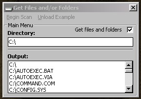



## Get All Folders \(and files\) in a directory

### Description

Get all the folders (and files) in a given directory. Very simple, and easy to use code. Just copy and paste into your own program.
 
### More Info
 
Location As String, GetFiles As Boolean, Listbox As Listbox, Dir As DirListBox, FileList As FileListBox

You will need a path to 'peek' inside, a listbox, directory listbox, and file listbox.

Returns nothing

The only side effect is that the listbox flicks a bit. Talk to Microsoft about that one ;]

             |
---                |---
**Submitted On**   |2002-06-19 15:56:04
**By**             |[TheWoot Software](https://github.com/Planet-Source-Code/PSCIndex/blob/master/ByAuthor/thewoot-software.md)
**Level**          |Intermediate
**User Rating**    |5.0 (15 globes from 3 users)
**Compatibility**  |VB 4\.0 \(32\-bit\), VB 5\.0, VB 6\.0
**Category**       |[Files/ File Controls/ Input/ Output](https://github.com/Planet-Source-Code/PSCIndex/blob/master/ByCategory/files-file-controls-input-output__1-3.md)
**World**          |[Visual Basic](https://github.com/Planet-Source-Code/PSCIndex/blob/master/ByWorld/visual-basic.md)
**Archive File**   |[Get\_All\_Fo966216192002\.zip](https://github.com/Planet-Source-Code/thewoot-software-get-all-folders-and-files-in-a-directory__1-36042/archive/master.zip)

### API Declarations

No API calls

